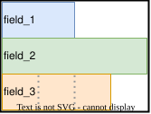
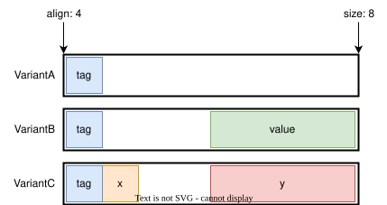
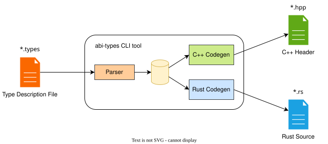
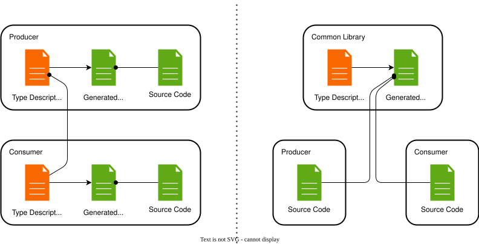
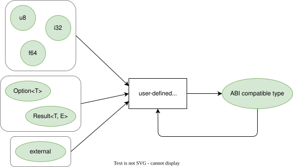
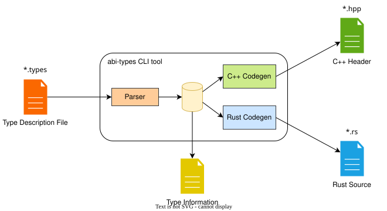
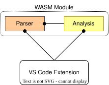

# ABI Compatible Data Types

Central problems to solve:

1. How to precisely specify an ABI type?
2. How to reliably verify its properties?

---

## Specifying ABI Types

We considered three approaches:

- A: Existing serialization libraries
- B: Native declarations in Rust/C++ code
- C: Custom type definition language

---

## Approach A: Existing Solutions

Use an existing serialization library (FlatBuffers, Cap'n Proto, …):

- None of them satisfy all requirements
  - Especially in-place construction
- Not very ergonomic
- Opinionated

---

## Approach B: *Definition-First*

Extract types from definitions in native code:

```rust
struct MotorStatus {
    rpm: f32,
    temperature: i16,
    cylinders: [CylinderStatus; 4],
}
```

Very hard to implement and get right:

- Parsing: okay in Rust, harder in C++ (pre-processor and system headers)
- Semantic analysis: necessary to resolve types
  (what does `Vector<T, 20>` mean exactly?)

More drawbacks:

- High effort: two parsing/analysis tools
- Types tend to get spread over code base

---

## Approach C: *Description-First*

Define a custom description language tailored to our needs:

- Easy to parse
- Language independent
- Full control over features (inclusive and exclusive)
- All types satisfy requirements *by construction*

---

## Goals

(besides ABI compatibility)

- Efficient: memory usage
- Efficient: fast writing and reading
- Ergonomic: convenient writing and reading

---

## The Result

```rust
/// A single echo point in a column.
struct Echo {
    row_index: u16,
    /// Distance in meters.
    distance: f32,
    amplitude: u8,
}

#[e2e_profile = E2ESomeUserProfile]
struct Column {
    mirror_side: u8,
    column_index: u16,
    echos: Vector<Echo, 192>,
}

enum Calibration {
    None,
    Coarse {
        distance_offset: f32,
        horizontal_resolution: f32,
        horizontal_offset: f32,
    },
    /// Precise angle per row.
    Fine {
        distance_offset: f32,
        horizontal_angles: Array<f32, 96>,
    },
}
```

---

## Memory Layout: Structs

<div class="columns">
<div class="column">

Struct description:

```rust
struct Example01 {
    field_1: u16,
    field_2: f32,
    field_3: array<u8, 3>,
}
```



</div>
<div class="column">

Generated code:

```rust
#[repr(C)]
pub struct Example01 {
    pub field_1: u16,
    pub field_2: f32,
    pub field_3: [u8; 3],
}
```

```c++
struct Example01 {
    std::uint16_t field_1;
    float field_2;
    std::array<std::uint8_t, 3> field_3;
};
```

</div>
</div>

---

## Memory Layout: Enums

<div class="columns">
<div class="column">

Enum description:

```rust
enum Example02 {
    VariantA,
    VariantB(f32),
    VariantC { x: u8, y: u32 },
}
```



</div>
<div class="column">

Generated code:

```rust
#[repr(u8)]
pub enum Example02 {
    VariantA = 0,
    VariantB(f32) = 1,
    VariantC { pub x: u8, pub y: u32 } = 2,
}
```

```c++
union Example02 {
public:
  enum class Tag : std::uint8_t {
    VariantA = 0,
    VariantB = 1,
    VariantC = 2,
  };
  // ...
  struct VariantB {
  private: Tag m_tag;
  public:  float value;
  };
  // ...
private:
  struct { Tag m_tag; };
  VariantA m_variant_a;
  VariantB m_variant_b;
  VariantC m_variant_c;
};
```

</div>
</div>

---

## Features

- Supports all primitive data types from the feature request
- Supports all type constructors from the feature request
  - Even variants/tagged unions
- Declaration of external types
  - For vector, queue, hash map, etc.
- Generate C++ or Rust code
- Extensible via attributes (`#[e2e_profile = ...]`)

---

## Workflow



---

## Use Cases



⇒ Gradual transition for existing projects

---

## Safety and Qualification

Safety qualification:

1. Show that base cases (primitive types, arrays, imported types) are ABI compatible.
2. Show that the tool constructs only ABI compatible types from ABI compatible types (induction step).



⇒ The generated type definitions are safe and don't need to be qualified themselves

---

## Planned Feature: Extract Descriptions



---

## Planned Feature: VS Code Extension



---

## Thank You

Questions?
